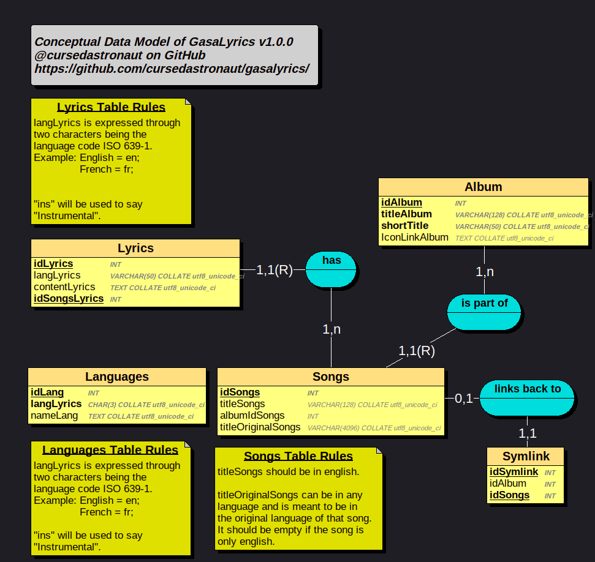

# GasaLyrics - 가사Lyrics
It's a website to display songs.

## Requirements
This website runs on the french ISP's server ("Free"). Since this service comes with the ISP for free, and it has been used for small websites since 2008, the requirements are quite outdated.
- PHP `4.4.3-dev`
- MySQL `5.0.83`
- Apache MySQL client `5.1.61`

## Database
The database is formed this way:

### Translation
Règles Lyrics: Rules of table Lyrics
`langLyrics` is expressed by two characters representing the language code.
Example: English -> en; French -> fr

`contentLyrics` is encoded using HTML entities to avoid compatibility issues with database handling of UTF-8 characters. (Free's MySQL replaces unknown characters by interrogation points).

Règles Songs: Rules of table Songs
`titleOriginalSongs` must also be encoded to HTML entities.

### Creating the tables

```sql
--Creation of Album table
CREATE TABLE IF NOT EXISTS `Album` (
  `idAlbum` int(11) NOT NULL auto_increment,
  `titleAlbum` varchar(128) collate latin1_general_ci default NULL,
  `iconLinkAlbum` text collate latin1_general_ci,
  `shortTitle` varchar(50) collate latin1_general_ci default NULL,
  PRIMARY KEY  (`idAlbum`)
) ENGINE=MyISAM  DEFAULT CHARSET=latin1 COLLATE=latin1_general_ci;

--Creation of Languages table
CREATE TABLE IF NOT EXISTS `Languages` (
  `idLang` int(11) NOT NULL auto_increment,
  `langLyrics` varchar(3) collate latin1_general_ci NOT NULL,
  `nameLang` text collate latin1_general_ci NOT NULL,
  PRIMARY KEY  (`idLang`),
  UNIQUE KEY `langLyrics` (`langLyrics`)
) ENGINE=MyISAM  DEFAULT CHARSET=latin1 COLLATE=latin1_general_ci;

--Creation of Lyrics table
CREATE TABLE IF NOT EXISTS `Lyrics` (
  `idLyrics` int(11) NOT NULL auto_increment,
  `langLyrics` varchar(128) character set latin1 collate latin1_general_ci default NULL,
  `contentLyrics` text character set utf8 collate utf8_unicode_ci,
  `idSongsLyrics` int(11) default NULL,
  PRIMARY KEY  (`idLyrics`)
) ENGINE=MyISAM  DEFAULT CHARSET=utf8 COLLATE=utf8_bin;

--Creation of Songs table
CREATE TABLE IF NOT EXISTS `Songs` (
  `idSongs` int(11) NOT NULL auto_increment,
  `titleSongs` varchar(128) character set utf8 collate utf8_unicode_ci default NULL,
  `titleOriginalSongs` varchar(4096) character set utf8 collate utf8_unicode_ci default NULL,
  `albumIdSongs` int(11) default NULL,
  PRIMARY KEY  (`idSongs`)
) ENGINE=MyISAM  DEFAULT CHARSET=latin1 COLLATE=latin1_general_ci;


--Creation of Symlink table
CREATE TABLE IF NOT EXISTS `Symlink` (
  `idSymlink` int(11) NOT NULL auto_increment,
  `idSongs` int(11) NOT NULL,
  `idAlbum` int(11) NOT NULL,
  PRIMARY KEY  (`idSymlink`),
  KEY `idSongs` (`idSongs`)
) ENGINE=MyISAM  DEFAULT CHARSET=latin1 COLLATE=latin1_general_ci;
```

## Configure the SQL access
Edit `res/php/config.php`, you can see an example in `res/php/config_example.php` ([See here](res/php/config_example.php)).